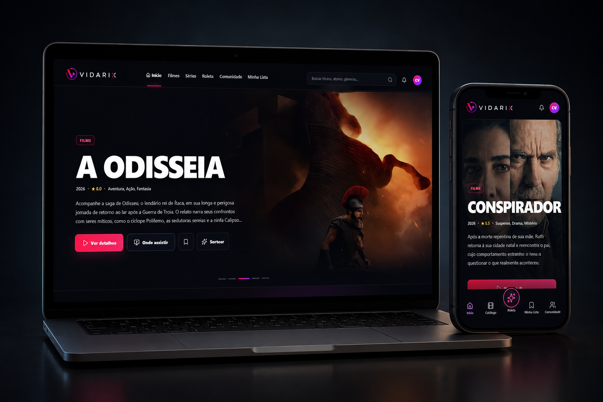

# VIDARIX

<p align="center">
  
</p>

<p align="center">
  <strong>Descubra, escolha e compartilhe o que assistir.</strong>
</p>

<p align="center">
  Plataforma de descoberta de filmes e séries com catálogo, roleta personalizada, listas, avaliações e recursos sociais em tempo real.
</p>

<p align="center">
  
  
  
  
  
</p>

---

## Sobre o projeto

A **VIDARIX** foi criada para resolver um problema comum: gastar mais tempo escolhendo o que assistir do que aproveitando o conteúdo.

A plataforma reúne descoberta de filmes e séries, disponibilidade nos streamings, listas pessoais, avaliações, recomendações, roleta cinematográfica e uma comunidade integrada.

A VIDARIX não reproduz nem hospeda conteúdo audiovisual. Seu objetivo é ajudar o usuário a **descobrir, decidir, organizar e compartilhar** o que pretende assistir.

---

## Funcionalidades

### Catálogo e descoberta

- filmes e séries em alta;
- títulos populares e mais bem avaliados;
- pesquisa global;
- filtros por tipo, gênero, nota, ano e plataforma;
- detalhes, sinopse, elenco, trailers e classificação;
- disponibilidade no Brasil para assinatura, aluguel e compra;
- dados fornecidos pela API do TMDB.

### Roleta VIDARIX

- sorteio por gênero;
- sorteio por streaming;
- sorteio entre títulos selecionados;
- modo surpresa;
- exclusão de títulos já assistidos;
- histórico de resultados;
- apresentação cinematográfica do título escolhido.

### Conta e personalização

- cadastro e login com Supabase Auth;
- onboarding de preferências;
- seleção dos streamings utilizados;
- escolha de gêneros favoritos;
- preferência entre filmes e séries;
- recuperação e redefinição de senha;
- sessão persistente.

### Perfil e biblioteca pessoal

- foto, nome, username e biografia;
- streamings assinados;
- gêneros favoritos e gêneros excluídos;
- controles de privacidade;
- lista para assistir;
- títulos assistidos;
- favoritos;
- avaliações e anotações;
- histórico da roleta.

### Comunidade

- busca de usuários;
- solicitações de amizade;
- amizades persistidas no Supabase;
- conversas particulares;
- mensagens em tempo real;
- grupos públicos e privados;
- recomendações para amigos e grupos;
- notificações persistentes;
- comentários, teorias, avaliações e curtidas por título;
- proteção contra spoilers.

---

## Arquitetura

```text
React + TypeScript + Vite
          │
          ├── Vercel                 → frontend
          ├── Supabase Auth          → login e cadastro
          ├── PostgreSQL + RLS       → perfis, listas e dados sociais
          ├── Supabase Realtime      → mensagens e notificações
          ├── Supabase Storage       → avatares
          └── Edge Function          → proxy seguro para o TMDB
```

A chave do TMDB permanece protegida nos **Secrets do Supabase** e não é enviada ao navegador.

---

## Tecnologias

| Área | Tecnologias |
|---|---|
| Interface | React 19, TypeScript, Tailwind CSS 4 |
| Build | Vite, ESBuild |
| Backend | Supabase Auth, PostgreSQL, Storage e Edge Functions |
| Tempo real | Supabase Realtime |
| Catálogo | TMDB API |
| Streaming | Dados do JustWatch disponibilizados pelo TMDB |
| Ícones e animações | Lucide React, Motion, Canvas Confetti |
| Aplicação web | PWA com Service Worker |
| Hospedagem | Vercel |

---

## Estrutura do projeto

```text
VIDARIX/
├── assets/
│   └── vidarix-preview.png
├── public/
│   ├── brand/
│   ├── providers/
│   ├── manifest.json
│   └── sw.js
├── src/
│   ├── components/
│   ├── context/
│   ├── data/
│   ├── lib/
│   ├── pages/
│   ├── services/
│   ├── App.tsx
│   └── main.tsx
├── supabase/
│   ├── functions/
│   │   └── tmdb-proxy/
│   ├── migrations/
│   └── config.toml
├── .env.example
├── README.md
├── vercel.json
├── package.json
├── tsconfig.json
└── vite.config.ts
```

---

## Banco de dados

### Dados individuais

- `profiles`
- `user_preferences`
- `user_streaming_providers`
- `user_favorite_genres`
- `user_excluded_genres`
- `watchlist`
- `watched_titles`
- `favorites`
- `roulette_history`
- `user_ratings`

### Dados sociais

- `friend_requests`
- `friendships`
- `conversations`
- `conversation_participants`
- `messages`
- `groups`
- `group_members`
- `group_messages`
- `group_watchlist`
- `recommendations`
- `notifications`
- `title_discussions`
- `discussion_likes`

As tabelas expostas utilizam **Row Level Security** para limitar o acesso de acordo com o usuário autenticado.

---

## Variáveis de ambiente

Crie um arquivo `.env` local com:

```env
VITE_SUPABASE_URL=
VITE_SUPABASE_PUBLISHABLE_KEY=
VITE_APP_URL=
```

A chave do TMDB deve ser configurada nos Secrets do Supabase:

```text
TMDB_API_KEY
```

> Nunca envie `.env`, chaves secretas, `service_role` ou credenciais administrativas para o GitHub.

---

## Rotas principais

```text
/                    Início
/filmes              Filmes
/series              Séries
/catalogo            Catálogo completo
/roleta              Roleta VIDARIX
/minha-lista          Biblioteca pessoal
/comunidade           Comunidade
/perfil               Perfil
/perfil/editar        Editar perfil
/configuracoes        Configurações
/entrar               Login
/criar-conta          Cadastro
/recuperar-senha      Recuperação de senha
/redefinir-senha      Redefinição de senha
/termos               Termos de uso
/privacidade          Política de privacidade
/sobre                Sobre a VIDARIX
```

---

## Segurança

- autenticação gerenciada pelo Supabase;
- políticas RLS no banco;
- conversas acessíveis apenas aos participantes;
- dados individuais isolados por usuário;
- chave do TMDB fora do frontend;
- avatares protegidos por políticas do Storage;
- cache da PWA preparado para receber novas versões.

---

## Próximas evoluções

- bloqueio de usuários;
- denúncias de comentários e mensagens;
- moderação avançada de grupos;
- presença online com Supabase Presence;
- roletas exclusivas para grupos;
- melhorias de acessibilidade;
- recomendações ainda mais personalizadas.

---

## Avisos legais

- A VIDARIX é uma plataforma independente de descoberta cinematográfica.
- A plataforma não hospeda, transmite ou disponibiliza obras audiovisuais.
- Dados de filmes e séries são fornecidos pelo TMDB.
- Informações de disponibilidade em streaming são fornecidas pelo JustWatch por meio do TMDB.
- Marcas, pôsteres, títulos e demais materiais pertencem aos respectivos proprietários.

---

<p align="center">
  <strong>VIDARIX — descubra o que assistir hoje.</strong>
</p>
